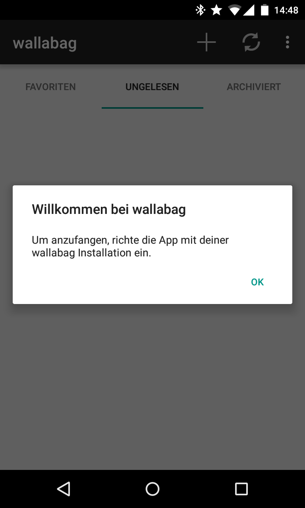
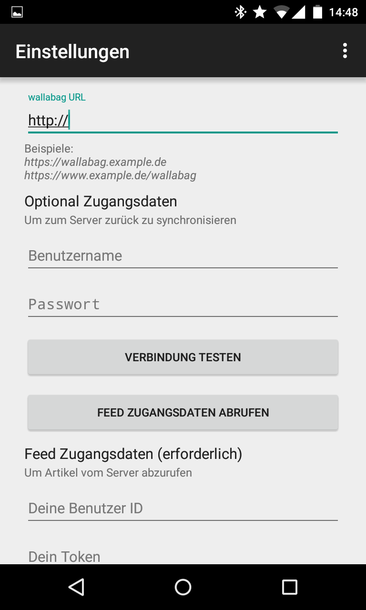
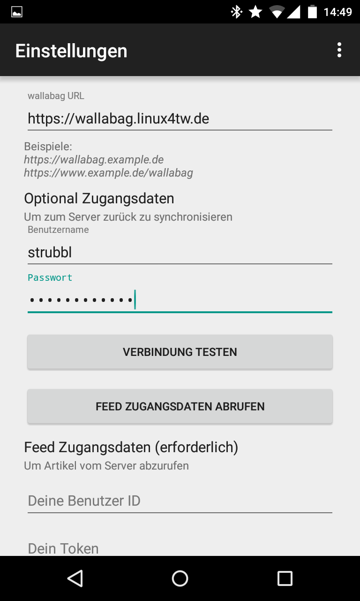
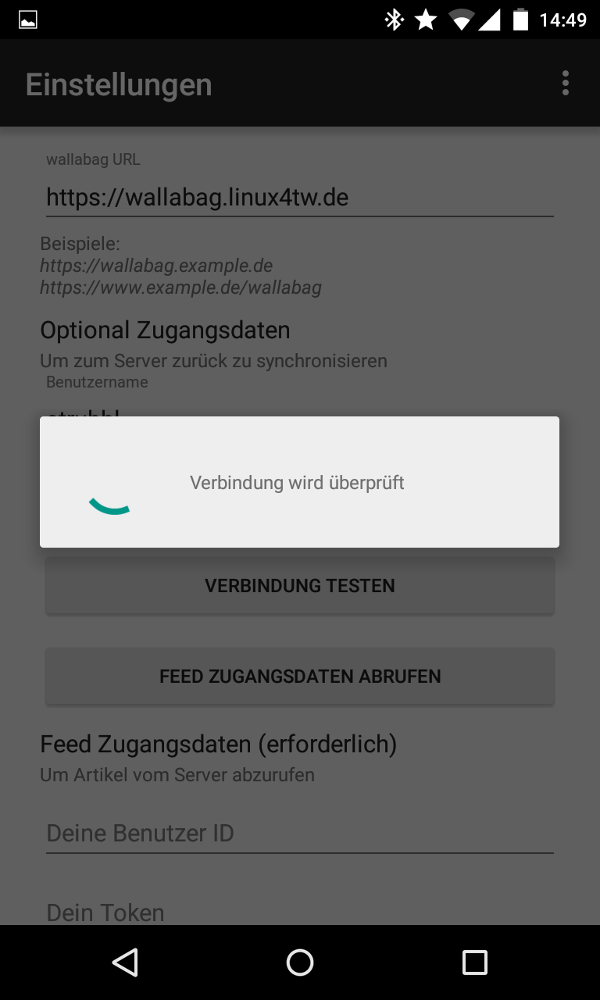
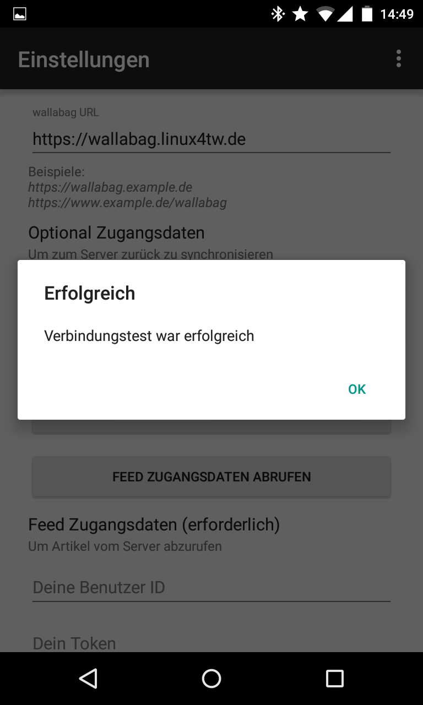
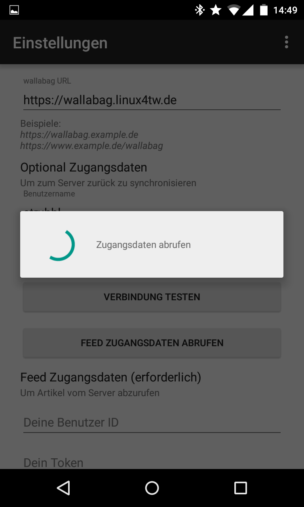
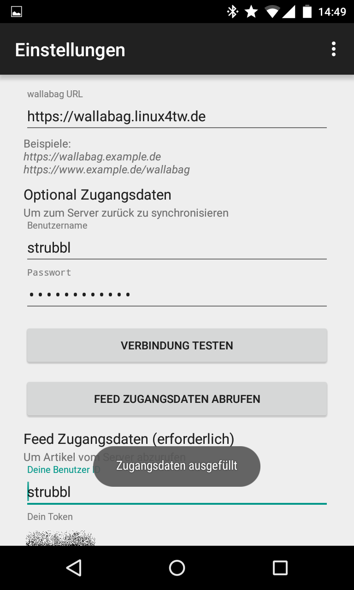
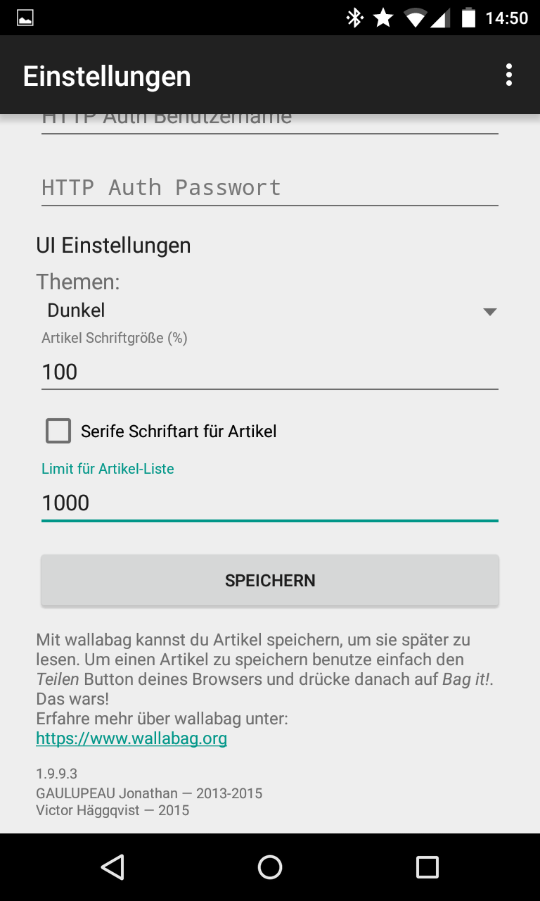
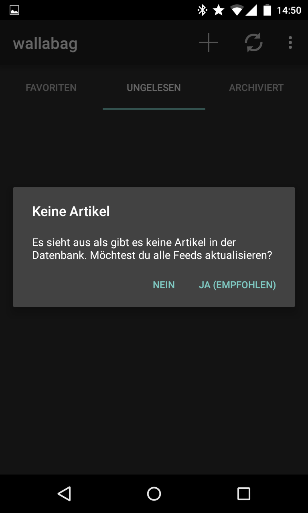
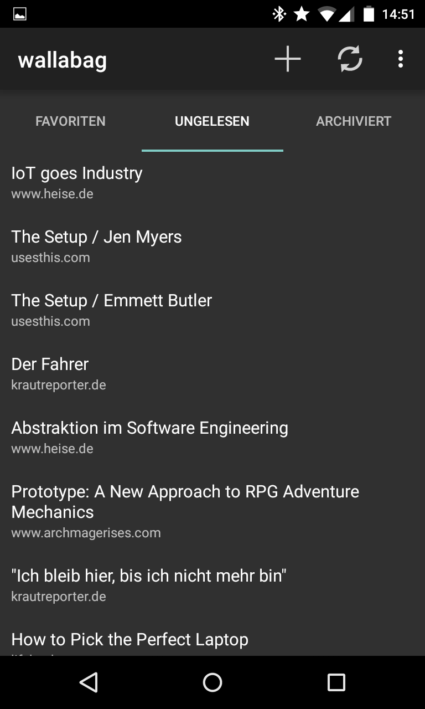

Android App
===========

Zweck dieses Dokuments
----------------------

Dieses Dokument beschreibt wie du deine Android App einrichtest, damit
sie mit deiner Wallabaginstanz zusammenarbeitet. Es gibt hierbei keinen
Unterschied im Vorgang - egal ob du Wallabag v1 oder v2 einsetzt.

Schritte, um dein App zu einzurichten
-------------------------------------

Wenn du das erste Mal die App startest, siehst du den
Willkommensbildschirm, wo du angewiesen wirst zunächst deine App mit
deiner Wallabaginstanz einzurichten.

Bestätige nur diese Nachricht und du wirst zum Einstellungsbildschirm
weitergeleitet.

Trage deine Wallabagdaten ein. Du musst deine Wallabagadresse eintragen.
**Es ist wichtig, dass die URL nicht mit einem Schrägstrich endet.**
Füge auch deine Wallabagzugangsdaten in das Nutzer- und Passwortfeld
ein.

Nachdem du deine Daten eingetragen hast, drücke den Button Verbindung
testen und warte auf das Fertigstellen des Tests.

Der Verbindungstest sollte mit Erfolg ausgehen. Falls nicht, musst du
zunächst deine Daten korrigieren bevor du zum nächsten Schritt gehst.

Nach dem Verbindungstest erfolgreich war, kannst du den Button zum
Feedzugangsdaten abholen drücken. Die App versucht nun sich bei deiner
Wallabaginstanz einzuloggen und die Nutzer ID und den dazugehörigen
Token für die Feeds zu laden.

Wenn der Prozess des Abholens deiner Feedzugangsdaten erfolgreich
beendet wurde, siehst du eine Toastnachricht, dass die User ID und der
Token automatisch in das Formular eingetragen wurden.

Jetzt scrollst du bis zum unteren Rand des Einstellungsbildschirms.
Natürlich kannst du die Einstellungen dort deinen Wünschen anpassen.
Schließe die Einrichtung mit dem Drücken des Speicherbuttons ab.

Nachdem du den Speicherbutton gedrückt hast, kommst du in den folgenden
Bildschirm. Die App schlägt vor, eine initiale Synchronisation der
Artikelfeeds durchzuführen. Hier ist es empfohlen, dies zu bestätigen
und Ja zu drücken.

Schließlich nach der ersten erfolgreichen Synchronisation, wird dir die
Liste der ungelesenen Artikel präsentiert.

Bekannte Limitierungen ---------------------

### Zwei-Faktor-Authentifizierung (2FA)

Zur Zeit unterstützt die App keine Zwei-Faktor Authentifizierung. Du
solltest sie deaktivieren damit die App funktioniert.

### Begrenzte Anzahl Artikel mit Wallabag v2

In deiner Wallabaginstanz kannst du einstellen, wie viele Artikel Teil
deiner RSS Feeds sind. Diese Option existierte in Wallabag v1 nicht, wo
immer alle Artikel Teil des Feeds waren. Also wenn du die Anzahl der
Artikel, die in der App angezeigt werden sollen, größer einstellst als
die Anzahl Artikel in deinem Feed, wirst du nur die Anzahl an Artikel
deines Feeds sehen.

### SSL/TLS Verschlüsselung

Wenn du deine Wallabaginstanz per HTTPS erreichen kannst, solltest du
das so konfigurieren. Besonders dann, wenn deine HTTP URL nach HTTPS
umleitet. Im Moment kann die App mit dieser Weiterleitung nicht korrekt
umgehen.

Referenzen
----------

-   [Quellcode der Android-App](https://github.com/wallabag/android-app)
-   [Android-App auf
    F-Droid](https://f-droid.org/repository/browse/?fdfilter=wallabag&fdid=fr.gaulupeau.apps.InThePoche)
-   [Android-App auf Google
    Play](https://play.google.com/store/apps/details?id=fr.gaulupeau.apps.InThePoche)

