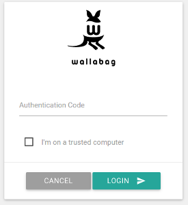

# Configuration

Now you're logged in, it's time to configure your account as you want.

Click on **Config** menu. You have five tabs:
* Settings
* RSS
* User information
* Password
* Tagging rules

## Settings
### Theme

wallabag is customizable. You can choose your prefered theme here. The
default theme is `Material`, it's the theme used in the documentation
screenshots.

### Items per page

You can change the number of articles displayed on each page.

### Reading speed

wallabag calculates a reading time for each article. You can define
here, through this list, if you are a fast or a slow reader. wallabag
will recalculate the reading time for each article.

### Redirection
Where do you want to be redirected after mark an article as read?

Each time you'll do some actions (after marking an article as
read/favorite, after deleting an article, after removing a tag from an
entry), you can be redirected:

-   To the homepage
-   To the current page

### Language

You can change the language of wallabag interface.

## RSS

wallabag provides RSS feeds for each article status: unread, starred and
archive.

Firstly, you need to create a personal token: click on
`Create your token`. It's possible to change your token by clicking on
`Reset your token`.

Now you have three links, one for each status: add them into your
favourite RSS reader.

You can also define how many articles you want in each RSS feed (default
value: 50).

There is also a pagination available for these feeds. You can add
`?page=2` to jump to the second page. The pagination follow [the
RFC](https://tools.ietf.org/html/rfc5005#page-4) about that, which means
you'll find the `next`, `previous` & `last` page link inside the
&lt;channel&gt; tag of each RSS feed.

## User information

You can change your name, your email address and enable
`Two factor authentication`.

If the wallabag instance has more than one enabled user, you can delete
your account here. **Take care, we delete all your data**.

### Two factor authentication (2FA)

> Two-factor authentication (also known as 2FA) is a technology patented
> in 1984 that provides identification of users by means of the
> combination of two different components.
>
> <https://en.wikipedia.org/wiki/Two-factor_authentication>

**Warning**: enabling 2FA from the configuration interface is only
possible if it has been authorized before in app/config/parameters.yml
by setting the *twofactor_auth* parameter to true (do not forget to run
`php bin/console cache:clear -e=prod` after modification).

If you enable 2FA, each time you want to login to wallabag, you'll
receive a code by email. You have to put this code on the following
form.

If you don't want to receive a code each time you want to login, you can
check the `I'm on a trusted computer` checkbox: wallabag will remember
you for 15 days.

## Password

You can change your password here (8 characters minimum).

## Tagging rules

If you want to automatically assign a tag to new articles, this part of
the configuration is for you.

### What does « tagging rules » mean?

They are rules used by wallabag to automatically tag new entries. Each
time a new entry is added, all the tagging rules will be used to add the
tags you configured, thus saving you the trouble to manually classify
your entries.

### How do I use them?

Let assume you want to tag new entries as *« short reading »* when the
reading time is inferior to 3 minutes. In that case, you should put «
readingTime &lt;= 3 » in the **Rule** field and *« short reading »* in
the **Tags** field. Several tags can added simultaneously by separating
them by a comma: *« short reading, must read »*. Complex rules can be
written by using predefined operators: if *« readingTime &gt;= 5 AND
domainName = "github.com" »* then tag as *« long reading, github »*.

### Which variables and operators can I use to write rules?

The following variables and operators can be used to create tagging
rules (be careful, for some values, you need to add quotes, for example
`language = "en"`):

  Variable      | Meaning                                          
  ------------- | ------------------------------------------------ ------------ -------------------------------------------------------------------------------------------------------
  title         | Title of the entry                               
  url           | URL of the entry                                 
  isArchived    | Whether the entry is archived or not             
  isStarred     | Whether the entry is starred or not              
  content       | The entry's content                              
  language      | The entry's language                             
  mimetype      | The entry's mime-type                            
  readingTime   | The estimated entry's reading time, in minutes   
  domainName    | The domain name of the entry                     

  Operator     | Meaning
  ------------- | -------------
  &lt;=         | Less than…
  &lt;         | Strictly less than…
  =&gt;        | Greater than…
  &gt;         | Strictly greater than…
  =            | Equal to…
  !=           | Not equal to…
  OR           | One rule or another
  AND          | One rule and another
  matches      | Tests that a subject is matches a search (case-insensitive). Example: title matches "football"
  notmatches   | Tests that a subject is not matches a search (case-insensitive). Example: title notmatches "football"
