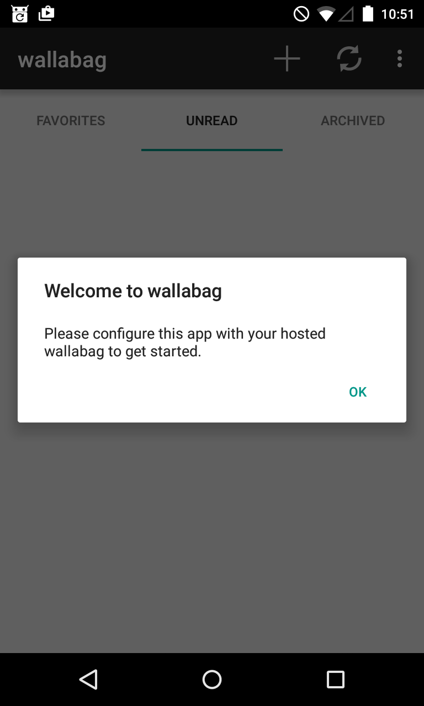
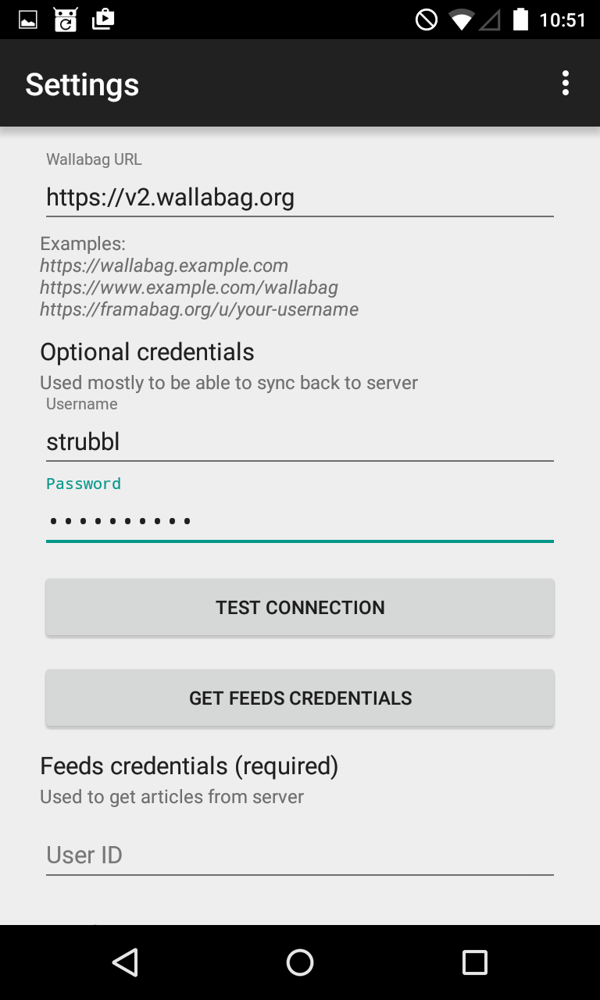
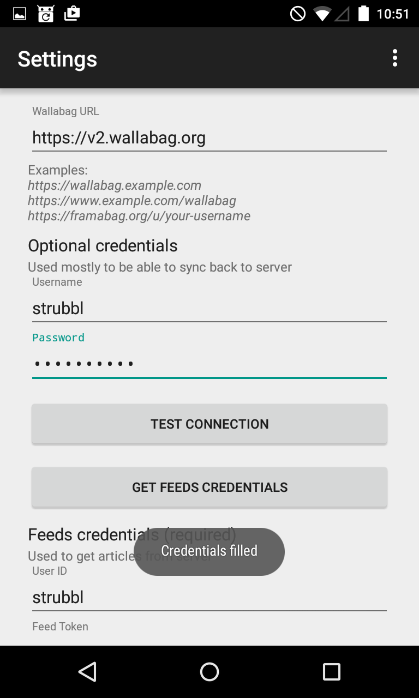
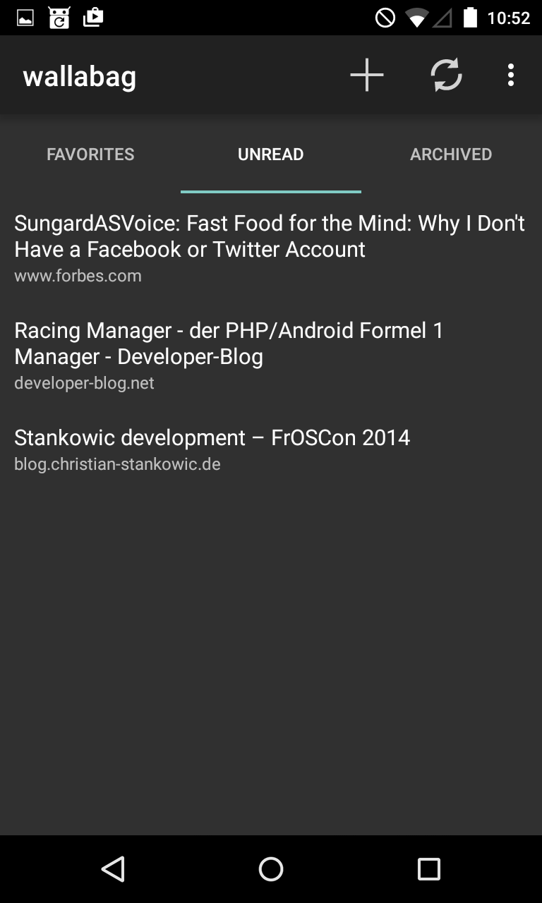

Application Android
===================

But de ce document
------------------

Ce document explique comment configurer votre application Android pour
qu'elle fonctionne avec votre instance de wallabag. Il n'y a pas de
différence dans cette procédure entre wallabag v1 et wallabag v2.

Étapes pour configurer votre application
----------------------------------------

Quand vous démarrez l'application pour la première fois, vous voyez le
message de bienvenue, où il vous est d'abord conseillé de configurer
l'application avec votre instance de wallabag.

Vous devez confirmer le message et vous serez redirigé vers l'écran de
configuration.

Saisissez vos données wallabag. Vous devez entrer l'adresse de votre
instance de wallabag. **Il ne faut pas que cette adresse se termine par
un slash**. Ajoutez également vos identifiants wallabag dans les champs
correspondants.

Après cet écran, appuyez sur le bouton de test de connexion et attendez
que le test se termine.

Le test de connexion devrait se terminer avec succès. Si ce n'est pas le
cas, vous devez résoudre ça avant de continuer.

Après le test de connexion réussi, vous pouvez cliquer sur le bouton
pour récupérer vos informations de flux (feed credentials).
L'application essaie maintenant de se connecter à wallabag pour
récupérer votre identifiant et votre jeton pour les flux RSS.

Quand le processus est terminé avec succès, vous verrez une notification
comme quoi l'identifiant et le jeton ont été remplis correctement.

Maintenant, vous devez naviguer jusqu'en bas de l'écran des paramètres.
Bien sur, vous pouvez régler les paramètres comme vous le souhaitez.
Enregistrez la configuration.

Après avoir enregistré les paramètres, vous vous retrouvez face à
l'écran suivant. L'application vous propose de démarrer une
synchronisation pour récupérer vos articles. Il est recommandé de
confirmer cette action.

Une fois la synchronisation terminée avec succès, vous pouvez lire vos
articles.

Limitations connues
-------------------

### Double authentification (2FA)

Actuellement, l'application Android ne supporte la double
authentification. Vous devez la désactiver pour que l'application
fonctionne correctement.

### Limiter le nombre d'articles avec wallabag v2

Dans votre instance de wallabag, vous pouvez configurer combien
d'articles se trouvent dans les flux RSS. Cette option n'existe pas dans
wallabag v1, où tous les articles se retrouvent donc dans le flux RSS.
So if you set the amount of articles being displayed greater than the
number of items being content of your RSS feed, you will only see the
number of items in your RSS feed.

### Cryptage SSL/TLS

Si vous souhaitez accéder à votre instance de wallabag via HTTPS, vous
devez le définir dans les paramètres. Surtout si votre URL HTTP redirige
vers l'URL HTTPS. Actuellement, l'application ne gère pas cette
redirection correctement.

Références
----------

-   [Code source de l'application
    Android](https://github.com/wallabag/android-app)
-   [Télécharger l'application Android sur
    F-Droid](https://f-droid.org/repository/browse/?fdfilter=wallabag&fdid=fr.gaulupeau.apps.InThePoche)
-   [Télécharger l'application Android sur Google
    Play](https://play.google.com/store/apps/details?id=fr.gaulupeau.apps.InThePoche)

